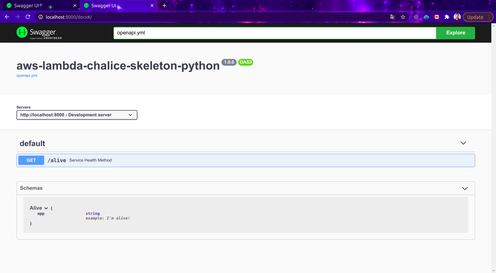
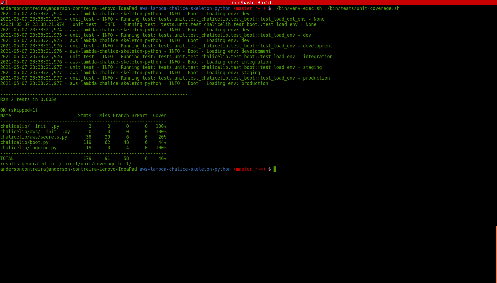
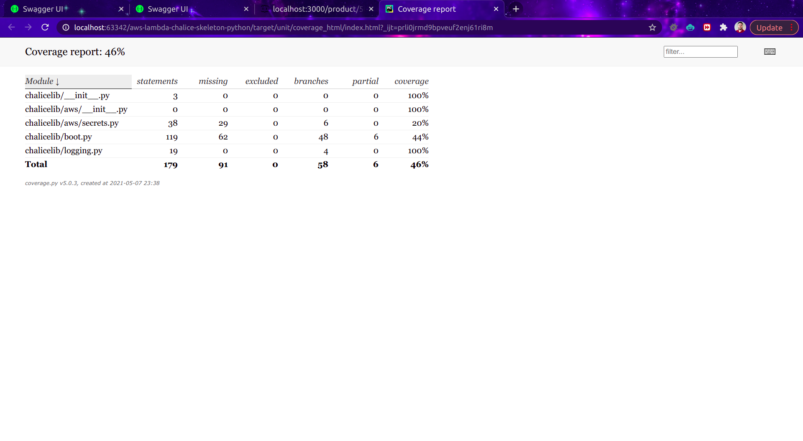

# Aws Lambda Chalice Skeleton for python 
Skeleton to create microservices using Chalice and Lambda.

## Service Architecture
This service is the main part of the follow architecture.
 
[comment]: <> (![AWS Architecture]&#40;docs/Sourcing_Service-V0.png&#41;)

## Swagger Docs
OpenApi example:


  
## Release notes 

In this section contains the release notes of the project.

> Version 1.0.0

 * First version of the project;

All the changes must be tracked in [CHANGELOG.md](CHANGELOG.md)

  
## Prerequisites
- Python 3.6
- python-dotenv
- jsonformatter
- requests
- pytz
- redis
- pyyaml
- apispec
- marshmallow
- Flask

## Features
- Docker-compose 
- OpenApi

## Installation

### Running Locally
To create the `venv` and install the modules execute:
```
./bin/venv.sh
```
#### Running the chalice
Execute the follow command:
```
./bin/flask/run-local.sh
```
### Running via docker
To execute the build:
```
./bin/runenv.sh --build
```

Execute the follow command:
```
./bin/runenv.sh
```

### Boot the queues
Execute the follow command:
```
./bin/boot.sh
```

## Samples
See the project samples in this folder [here](samples).

## Running tests
To run the unit tests of the project you can execute the follow command:

First you need install the tests requirements:
 ```
 ./bin/venv-exec.sh ./bin/tests/install-tests.sh 
 ```

 
### Unit tests:
Execute the follow command:
 ```
./bin/venv-exec.sh ./bin/tests/unit-tests.sh
 ``` 

### Components tests:
Booting the environment:
 ```
./bin/runenv.sh
```

Executing the tests:
 ```
./bin/venv-exec.sh ./bin/tests/component-tests.sh
```
### Integration tests:
Executing the tests:
 ```
./bin/venv-exec.sh ./bin/tests/integration-tests.sh
```


### All tests:
Executing the tests:
```
 ./bin/venv-exec.sh ./bin/tests/tests.sh 
 ```

## Generating coverage reports
To execute coverage tests you can execute the follow commands:

Unit test coverage:
``` 
./bin/venv-exec.sh ./bin/tests/unit-coverage.sh
``` 

Component test coverage:
``` 
./bin/venv-exec.sh ./bin/tests/component-coverage.sh
```

Integration test coverage:
``` 
./bin/venv-exec.sh ./bin/tests/integration-coverage.sh
```
> Observation:

The result can be found in the folder `target/*`.

### Tests results examples:
Unit test console:

Unit test coverage report in HTML:

## License
See the license [LICENSE.md](LICENSE.md).

## Contributions
* Anderson de Oliveira Contreira [andersoncontreira](https://github.com/andersoncontreira)